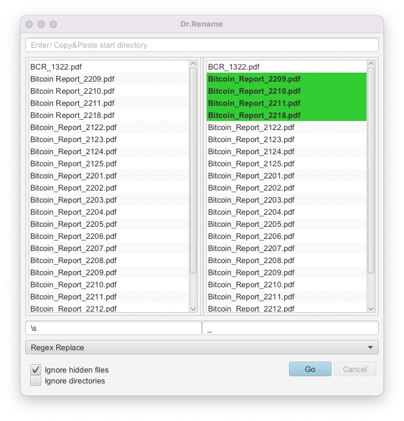
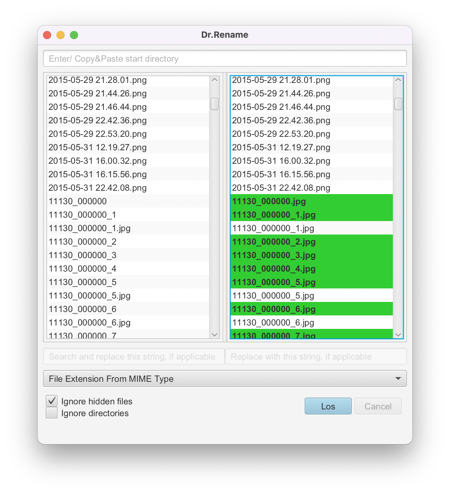

# Dr.Rename

Minimalistic Batch-Renamer

## Prerequirements

You need to have Java **17** installed.

## Installation and Starting

Download [latest Release](https://github.com/drrename/drrename/releases/latest) and call `java -jar drrename-<current-version>.jar`. A double click on the jar-file could also work.

Note that Java needs to be installed.

## Examples

1. Replace any space by an underscore 

### Pictures

1. Get extension from MIME type. Note that this will also add missing extensions:
 

## Kodi Tools

Open Kodi Tools via `File` -> `Kodi Tools`.

Kodi Tools help you to inspect and partly correct a [Kodi](https://kodi.tv/) media library.
The library set up is expected to be as follows (taken from [Kodi Wiki](https://kodi.wiki/view/Naming_video_files/Movies)):

> Each movie is saved in its own folder within the Source.
All files and folders should be simply named with the name of the movie and the year in brackets. The name should match the name shown at the scraper site.
> Each movie file is placed into its own folder which is then added to your Source.
> + Placing movies in their own folder allows saving of local artwork and NFO files alongside the movie file.
> + You have the choice of using the Short or Long name format for the artwork. See: Local Artwork
> + Using this method will provide the safest and most accurate scrape of your media collection.
> + Most library related add-ons will only work correctly with this method.
> + Some skins use modified file naming to display additional Media Flags. These apply to the filename, not the folder name.

Kodi Tools perform the following checks:

1. Look up the movie name (i.e., the *folder* name) on [theMovieDB](https://www.themoviedb.org/). If the exact folder name could not be found on theMovieDB, but suggestions are available, those are offered as a quick fix. Localized titles are suggested depending on your [locale setting](link to locale).
    
   
