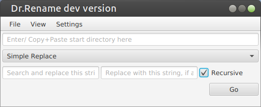
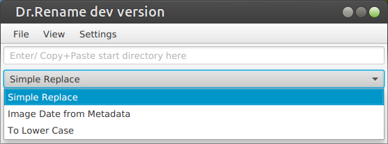
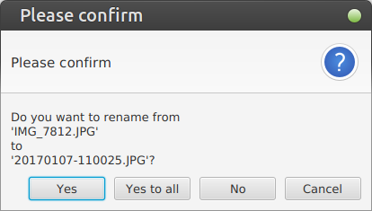
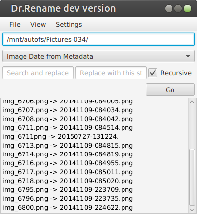

# Dr.Rename

## Minimalistic Batch-Renamer

### Features

+ Rename image files by metadata-date.
+ Simple replace-renaming.
+ To-lowercase-renaming.

## Documentation

[[Wiki|github.com/kerner1000/drrename/wiki]]

## Screenshots

